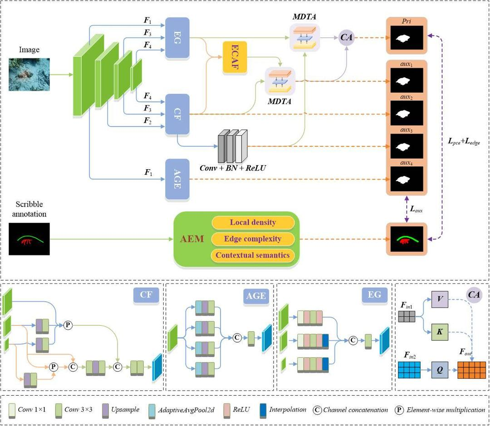
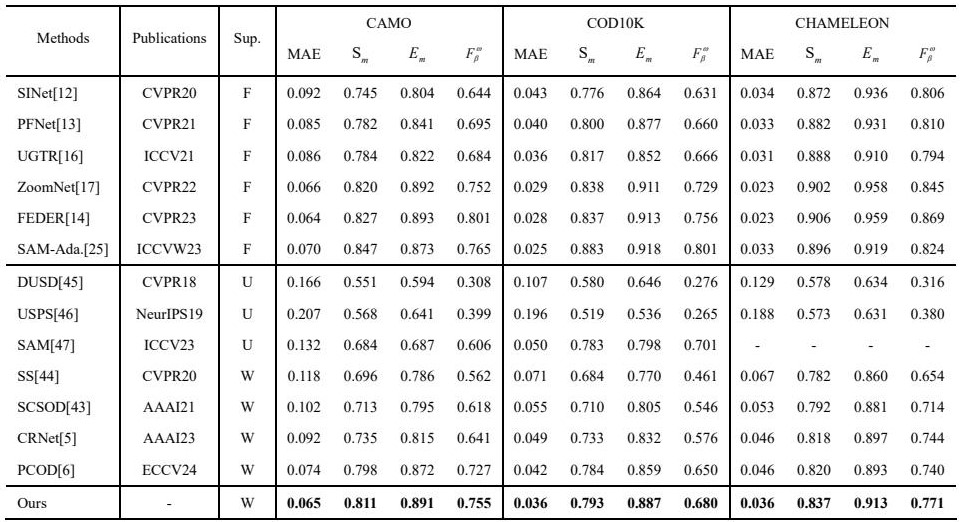

# Simple Labels, Rich Supervision: A Self-Adaptive Label Expansion Based Weakly Supervised Camouflaged Object Detection 
> Authors: Chen Wang*, Xu Jia*

## Dataset
- Download the training dataset (COD10K-train) at [here](https://drive.google.com/file/d/1D9bf1KeeCJsxxri6d2qAC7z6O1X_fxpt/view?usp=sharing).
- Download the testing dataset (COD10K-test + CAMO-test + CHAMELEON) at [here](https://drive.google.com/file/d/1QEGnP9O7HbN_2tH999O3HRIsErIVYalx/view?usp=sharing).
- Downloadadaptive scribble extension [labels]() for training.

## Experimental Results

### Pretrained weights
The pretrained weight can be found here:
[pvt_v2_b2](https://drive.google.com/file/d/1Or3V5O3gA0w7MM6ZhQ7r00kpxfKO93GY/view?usp=drive_link).

### Train
- run generate_smart_pseudo_labels.py to Generate adaptive scribble extension labels using the [S-COD](https://drive.google.com/file/d/1u7PRtZDu2vXCRe0o2SplVYa7ESoZQFR-/view?usp=sharing) dataset
- Download training dataset and testing dataset and put them in the right path.
- Modify the path in `train.py`.
- Run `python train.py`.

### Test
- Modify the path and filename.
- Run `python test.py`.

# Acknowledgement
[Weakly-Supervised Camouflaged Object Detection with Scribble Annotations](https://github.com/dddraxxx/Weakly-Supervised-Camouflaged-Object-Detection-with-Scribble-Annotations)
